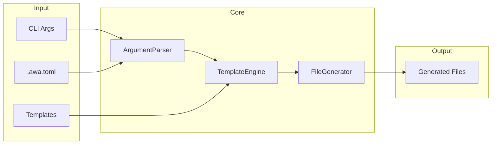
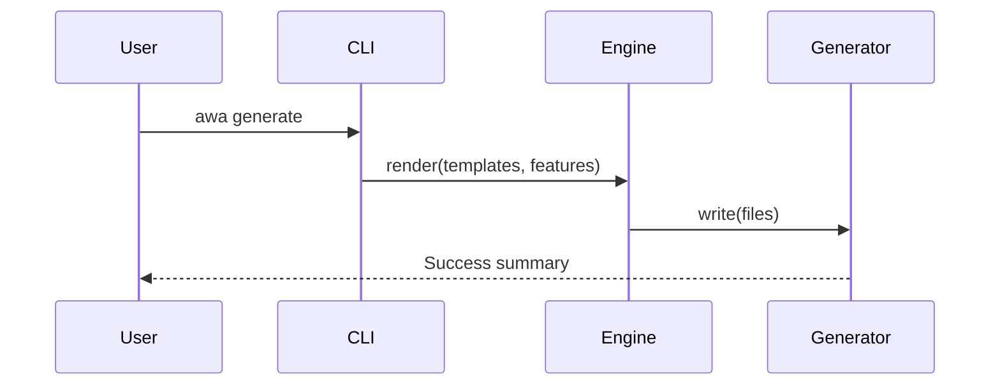

<schema target-file=".awa/specs/ARCHITECTURE.md">
- You MUST write API specs in TypeSpec format unless requested otherwise.
- If written in TypeSpec, API specifications follow TypeSpec format conventions.

```json
{
  "description": "Architecture only. Succinct language. Do not overspecify. Omit irrelevant information.",
  "required": ["projectPurpose", "systemOverview", "technologyStack", "architectureDiagram", "directoryStructure", "componentDetails", "componentInteractions", "architecturalRules", "developerCommands"],
  "properties": {
    "projectPurpose": { "type": "single paragraph: core problem and primary functionality" },
    "systemOverview": { "type": "array of software layers/subsystems" },
    "technologyStack": { "type": "array", "items": { "properties": { "technology": { "type": "name with major version only" }, "purpose": {} } } },
    "architectureDiagram": { "type": "mermaid diagram showing components, data flow, dependencies" },
    "directoryStructure": { "type": "array", "items": { "properties": { "path": {}, "description": {} } } },
    "componentDetails": { "type": "array", "items": { "$ref": "#/$defs/component" } },
    "componentInteractions": {
      "required": ["description"],
      "properties": {
        "description": {},
        "diagrams": { "type": "array", "items": { "properties": { "title": {}, "mermaid": {} } } }
      }
    },
    "architecturalRules": { "type": "array covering performance, scaling, maintainability, security, testing" },
    "releaseStatus": { "type": "string: current release phase (e.g., Alpha, Beta, RC, GA) with brief description" },
    "developerCommands": { "type": "array", "items": { "properties": { "command": {}, "description": {} } } },
    "metadata": { "properties": { "changeLog": { "type": "array", "items": { "properties": { "version": {}, "date": {}, "changes": {} } } } } }
  },
  "$defs": {
    "component": {
      "required": ["name", "description", "responsibilities"],
      "properties": {
        "name": {},
        "description": { "type": "single sentence" },
        "responsibilities": { "type": "array of strings" },
        "constraints": { "type": "array of strings" }
      }
    }
  },
  "$render": {
    "template": "# Architecture\n\n## Project Purpose\n{projectPurpose}\n\n## System Overview\n{systemOverview→'- {}'}\n\n## Technology Stack\n{technologyStack→'- `{technology}` — {purpose}'}\n\n## High-Level Architecture\n```mermaid\n{architectureDiagram}\n```\n\n## Directory Structure\n```\n{directoryStructure→'{path}  # {description}'}\n```\n\n## Component Details\n{componentDetails→'### {name}\n\n{description}\n\nRESPONSIBILITIES\n{responsibilities→\"- {}\"}\n\nCONSTRAINTS\n{constraints?→\"- {}\"}'}\n\n## Component Interactions\n{componentInteractions.description}\n{componentInteractions.diagrams→'### {title}\n```mermaid\n{mermaid}\n```'}\n\n## Architectural Rules\n{architecturalRules→'- {}'}\n\n## Release Status\n{releaseStatus}\n\n## Developer Commands\n{developerCommands→'- `{command}` — {description}'}\n\n## Change Log\n{metadata.changeLog→'- {version} ({date}): {changes}'}",
    "omit": ["CONSTRAINTS section if empty", "diagrams section if empty"],
    "prohibited": ["**bold** — use CAPITALS", "minor versions in tech stack (major only)", "non-architecture directories", "detailed implementation in component descriptions"]
  }
}
```

<example>
# Architecture

## Project Purpose

awa CLI generates AI coding agent configuration files from templates, enabling developers to quickly scaffold consistent agent setups across projects.

## System Overview

- CLI Layer
- Core Engine
- Template System
- I/O Layer

## Technology Stack

- `Node.js 20` — Runtime environment
- `TypeScript 5` — Type-safe development
- `Eta 3` — Template rendering
- `Citty` — CLI framework

## High-Level Architecture



## Directory Structure

```
src/           # Source code
src/cli/       # CLI entry and commands
src/core/      # Core engine logic
src/utils/     # Shared utilities
templates/     # Bundled templates
```

## Component Details

### CLI Layer

Handles argument parsing and command dispatch.

RESPONSIBILITIES

- Parse CLI arguments and options
- Load and merge configuration
- Dispatch to appropriate command handlers

CONSTRAINTS

- Must fail fast on invalid arguments
- Must support --help and --version

### Template Engine

Renders templates with feature flag context.

RESPONSIBILITIES

- Load templates from local or remote sources
- Render with Eta templating
- Detect empty output for conditional file creation

## Component Interactions

The CLI parses arguments, loads configuration, then passes resolved options to the template engine which renders files through the generator.

### Generate Command Flow



## Architectural Rules

- All file I/O must go through the I/O layer
- Core engine must not depend on CLI layer
- Templates must be stateless and deterministic
- Errors must provide actionable messages with file paths
- All public APIs must have TypeScript types

## Release Status

STATUS: Alpha

Core functionality implemented. API may change without notice.

## Developer Commands

- `npm install` — Install dependencies
- `npm run dev` — Run in development mode
- `npm test` — Run test suite
- `npm run lint` — Run linter
- `npm run build` — Build for production

## Change Log

- 1.0.0 (2025-01-10): Initial architecture
- 1.1.0 (2025-01-15): Added diff command
</example>

</schema>