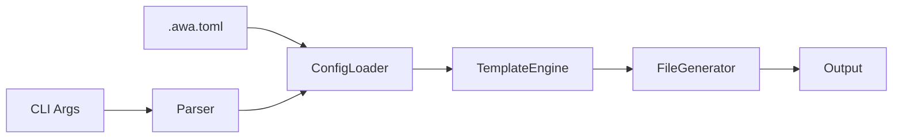

<schema target-files=".awa/specs/DESIGN-{feature-name}.md">

```json
{
  "description": "Design only. Succinct language. Do not overspecify. Omit irrelevant information.",
  "required": ["overview", "architecture", "componentsAndInterfaces", "dataModels", "correctnessProperties", "errorHandling", "testingStrategy", "requirementsTraceability"],
  "properties": {
    "overview": { "type": "technical approach and rationale; reference REQ, do not restate" },
    "architecture": {
      "required": ["highLevelArchitecture", "moduleOrganization"],
      "properties": {
        "affectedLayers": { "type": "array of layer names" },
        "highLevelArchitecture": { "properties": { "description": {}, "diagram": { "type": "mermaid" } } },
        "moduleOrganization": { "properties": { "structure": { "type": "directory tree" }, "description": {} } },
        "architecturalDecisions": { "type": "array", "items": { "$ref": "#/$defs/decision" } }
      }
    },
    "componentsAndInterfaces": { "type": "array", "items": { "$ref": "#/$defs/component" } },
    "dataModels": {
      "required": ["coreTypes"],
      "properties": {
        "coreTypes": { "type": "array", "items": { "$ref": "#/$defs/dataType" } },
        "entities": { "type": "array", "items": { "$ref": "#/$defs/entity" } }
      }
    },
    "correctnessProperties": { "type": "array of formal invariants for property-based testing", "items": { "$ref": "#/$defs/property" } },
    "errorHandling": {
      "required": ["errorTypes", "strategy"],
      "properties": {
        "errorTypes": { "type": "array", "items": { "$ref": "#/$defs/errorType" } },
        "strategy": { "properties": { "principles": { "type": "array of strings" } } }
      }
    },
    "testingStrategy": {
      "required": ["propertyBasedTesting"],
      "properties": {
        "propertyBasedTesting": {
          "required": ["framework", "minimumIterations"],
          "properties": {
            "framework": {},
            "minimumIterations": { "type": "integer" },
            "tagFormat": {},
            "exampleTests": { "type": "array", "items": { "properties": { "propertyId": {}, "code": {} } } }
          }
        },
        "unitTesting": { "properties": { "description": {}, "areas": { "type": "array" } } },
        "integrationTesting": { "properties": { "description": {}, "scenarios": { "type": "array" } } }
      }
    },
    "requirementsTraceability": {
      "required": ["source", "matrix"],
      "properties": {
        "source": { "type": "path to requirements file" },
        "matrix": { "type": "array", "items": { "$ref": "#/$defs/traceEntry" } }
      }
    },
    "libraryUsage": {
      "properties": {
        "frameworkFeatures": { "type": "array", "items": { "properties": { "feature": {}, "usage": {} } } },
        "externalLibraries": { "type": "array", "items": { "properties": { "name": {}, "version": {}, "purpose": {} } } }
      }
    },
    "metadata": { "properties": { "changeLog": { "type": "array", "items": { "properties": { "version": {}, "date": {}, "changes": {} } } } } }
  },
  "$defs": {
    "decision": { "required": ["decision", "rationale"], "properties": { "decision": {}, "rationale": {}, "alternatives": { "type": "array" } } },
    "component": {
      "required": ["name", "description", "interface"],
      "properties": {
        "name": { "type": "pattern: {CODE}-{ComponentName} (e.g., CLI-Parser, CFG-ConfigLoader)" },
        "description": { "type": "HOW it works, not WHAT (WHAT is in ACs)" },
        "implements": { "type": "array of AC IDs (e.g., CFG-1_AC-1, CFG-1_AC-2)" },
        "interface": { "type": "code block" }
      }
    },
    "dataType": { "required": ["name"], "properties": { "name": {}, "description": {}, "definition": { "type": "code block" } } },
    "entity": { "required": ["name", "fields"], "properties": { "name": {}, "description": {}, "fields": { "type": "array", "items": { "properties": { "name": {}, "type": {}, "required": {}, "description": {} } } } } },
    "property": {
      "required": ["id", "name", "description", "validates"],
      "properties": {
        "id": { "type": "pattern: {CODE}_P-{n} (e.g., CFG_P-1, GEN_P-2)" },
        "name": {},
        "description": {},
        "validates": { "type": "array of AC or REQ IDs (e.g., CFG-4_AC-1, GEN-6)" }
      }
    },
    "errorType": { "required": ["name", "variants"], "properties": { "name": {}, "description": {}, "variants": { "type": "array", "items": { "properties": { "name": {}, "description": {} } } } } },
    "traceEntry": {
      "required": ["criterionId", "componentName"],
      "properties": {
        "criterionId": { "type": "{CODE}-{n}[.{p}]_AC-{m}" },
        "componentName": { "type": "{CODE}-{ComponentName}" },
        "propertyId": { "type": "{CODE}_P-{n}" },
        "status": { "enum": ["implemented", "partial", "deferred", "n/a"] },
        "notes": {}
      }
    }
  },
  "$render": {
    "template": "# Design Specification\n\n## Overview\n{overview}\n\n## Architecture\n\nAFFECTED LAYERS: {affectedLayers?}\n\n### High-Level Architecture\n{architecture.highLevelArchitecture.description}\n\n```mermaid\n{architecture.highLevelArchitecture.diagram}\n```\n\n### Module Organization\n```\n{architecture.moduleOrganization.structure}\n```\n\n### Architectural Decisions\n{architecturalDecisions→'- {DECISION}: {rationale}. Alternatives: {alternatives?}'}\n\n## Components and Interfaces\n{componentsAndInterfaces→'### {name}\n\n{description}\n\nIMPLEMENTS: {implements?}\n\n```typescript\n{interface}\n```'}\n\n## Data Models\n\n### Core Types\n{dataModels.coreTypes→'- {NAME}: {description}\n```typescript\n{definition}\n```'}\n\n### Entities\n{dataModels.entities→'### {name}\n{description}\n{fields→\"- {NAME} ({type}, {required?}): {description}\"}'}\n\n## Correctness Properties\n{correctnessProperties→'- {id} [{name}]: {description}\n  VALIDATES: {validates}'}\n\n## Error Handling\n{errorHandling.errorTypes→'### {name}\n{description}\n{variants→\"- {NAME}: {description}\"}'}\n\n### Strategy\nPRINCIPLES:\n{errorHandling.strategy.principles→'- {}'}\n\n## Testing Strategy\n\n### Property-Based Testing\n- FRAMEWORK: {testingStrategy.propertyBasedTesting.framework}\n- MINIMUM_ITERATIONS: {testingStrategy.propertyBasedTesting.minimumIterations}\n- TAG_FORMAT: {testingStrategy.propertyBasedTesting.tagFormat?}\n{testingStrategy.propertyBasedTesting.exampleTests→'```typescript\n// @awa-test: {propertyId}\n{CODE}\n```'}\n\n### Unit Testing\n{testingStrategy.unitTesting.description?}\n- AREAS: {testingStrategy.unitTesting.areas?}\n\n### Integration Testing\n{testingStrategy.integrationTesting.description?}\n- SCENARIOS: {testingStrategy.integrationTesting.scenarios?}\n\n## Requirements Traceability\nSOURCE: {requirementsTraceability.source}\n{requirementsTraceability.matrix→'- {criterionId} → {componentName} ({propertyId?}) [{status?|omit if implemented}] {notes?}'}\n\n## Library Usage\n\n### Framework Features\n{libraryUsage.frameworkFeatures→'- {FEATURE}: {usage}'}\n\n### External Libraries\n{libraryUsage.externalLibraries→'- {name} ({version}): {purpose}'}\n\n## Change Log\n{metadata.changeLog→'- {version} ({date}): {changes}'}",
    "omit": ["section if empty", "AFFECTED LAYERS if absent", "IMPLEMENTS if empty", "(propertyId) if absent", "[status] if implemented", "notes/alternatives if empty"],
    "prohibited": ["**bold** — use CAPITALS", "*italic*", "tables — use lists", "ASCII diagrams — use mermaid", "FieldName: value patterns", "restating WHAT (requirements) — describe HOW (design)"]
  }
}
```

<example>
# Design Specification

## Overview

This design implements a CLI pipeline architecture for template-based code generation. The pipeline flows through argument parsing, configuration loading, template resolution, rendering, and file output with conflict resolution.

## Architecture

AFFECTED LAYERS: CLI Layer, Core Engine, I/O Layer

### High-Level Architecture

Sequential pipeline for predictable flow and error handling.



### Module Organization

```
src/
├── cli/
│   └── index.ts
├── core/
│   ├── config.ts
│   ├── template.ts
│   └── generator.ts
└── utils/
    └── fs.ts
```

### Architectural Decisions

- PIPELINE OVER EVENT: Sequential pipeline for predictable flow and error handling. Alternatives: event-driven, middleware chain

## Components and Interfaces

### CFG-ConfigLoader

Loads TOML configuration from file, merges with CLI arguments (CLI wins), and produces resolved options with defaults applied.

IMPLEMENTS: CFG-1_AC-1, CFG-1_AC-2, CFG-4_AC-1

```typescript
interface ConfigLoader {
  load(configPath: string | null): Promise<FileConfig | null>;
  merge(cli: RawCliOptions, file: FileConfig | null): ResolvedOptions;
}
```

## Data Models

### Core Types

- RESOLVED_OPTIONS: Fully resolved configuration with all defaults applied

```typescript
interface ResolvedOptions {
  readonly output: string;
  readonly template: string | null;
  readonly features: readonly string[];
  readonly force: boolean;
}
```

## Correctness Properties

- CFG_P-1 [CLI Override]: CLI arguments always override config file values for the same option
  VALIDATES: CFG-4_AC-1, CFG-4_AC-2

- GEN_P-2 [Dry Run Immutable]: Dry-run mode never modifies the file system
  VALIDATES: GEN-6_AC-1, GEN-6_AC-2

## Error Handling

### ConfigError

Configuration loading and parsing errors

- FILE_NOT_FOUND: Config file does not exist when --config provided
- PARSE_ERROR: TOML syntax error with line number

### Strategy

PRINCIPLES:

- Fail fast on first error
- Provide actionable error messages with file paths
- Exit with non-zero code on any error

## Testing Strategy

### Property-Based Testing

- FRAMEWORK: fast-check
- MINIMUM_ITERATIONS: 100
- TAG_FORMAT: @awa-test: {CODE}_P-{n}

```typescript
// @awa-test: CFG_P-1
test.prop([fc.string(), fc.string()])('CLI overrides config', (cliValue, configValue) => {
  const cli = { output: cliValue };
  const config = { output: configValue };
  const result = configLoader.merge(cli, config);
  expect(result.output).toBe(cliValue);
});
```

### Unit Testing

Test individual components in isolation

- AREAS: CFG-ConfigLoader merge logic, TPL-TemplateResolver type detection

## Requirements Traceability

SOURCE: .awa/specs/REQ-CLI.md, .awa/specs/REQ-CFG.md

- CFG-1_AC-1 → CFG-ConfigLoader (CFG_P-1)
- CFG-4_AC-1 → CFG-ConfigLoader (CFG_P-1)
- GEN-6_AC-1 → GEN-FileGenerator (GEN_P-2) [partial] pending review

## Library Usage

### Framework Features

- CITTY: Command definition, argument parsing, help generation

### External Libraries

- citty (latest): CLI framework
- smol-toml (1.x): TOML parser

## Change Log

- 1.0.0 (2025-01-10): Initial design
</example>

</schema>