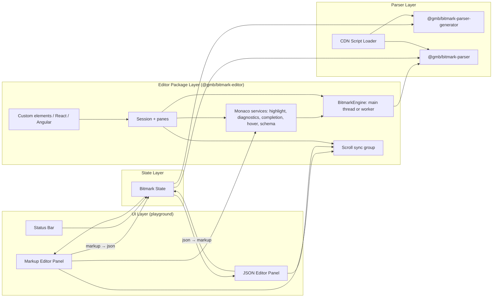
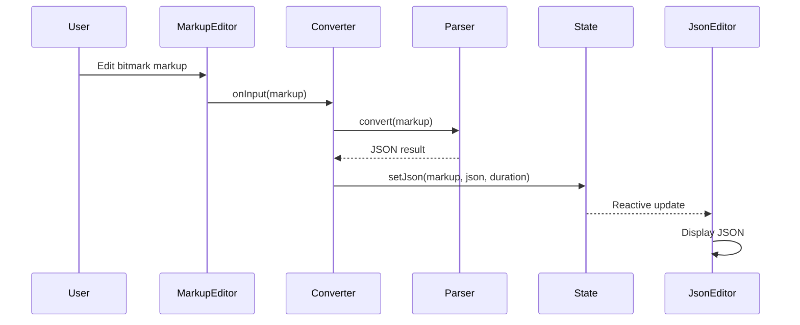
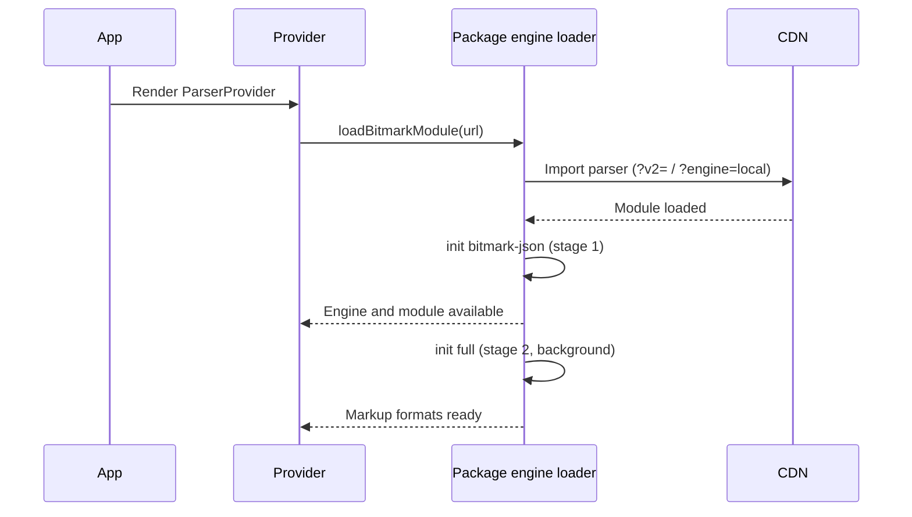

# Architecture

## Project Purpose

bitmark Playground is a web-based tool that enables real-time bidirectional conversion between bitmark markup and JSON, providing developers and content authors with an interactive environment to parse, validate, and experiment with bitmark content. Its editors are also published as a framework-agnostic package, `@gmb/bitmark-editor` (with an Angular wrapper), for other hosts such as the cosmic web app and the bitmark docs site.

## System Overview

- UI Layer — React SPA with side-by-side editor panels
- Editor Layer — Monaco Editor with bitmark highlighting from the WASM parser's semantic tokens
- Parser Layer — Pluggable bitmark parsers loaded dynamically from CDN
- State Layer — Reactive state management via Valtio
- Editor Package Layer — `@gmb/bitmark-editor`: the framework-free editor core (engine, session, panes, Monaco services), its custom elements and React adapter, and `@gmb/bitmark-editor-angular`
- Build Layer — Bun workspaces and Vite for the playground; esbuild for the package; Angular CLI for the Angular wrapper

## Technology Stack

- `React 18` — UI framework
- `TypeScript 5` — Type-safe development
- `Monaco Editor 0` — Code editor (0.52 in the playground; the package supports 0.46 to 0.57)
- `Valtio 1` — Proxy-based reactive state management (playground only)
- `Theme UI 0` — Themeable component styling (playground only)
- `Vite 6` — Playground dev server and build
- `esbuild 0` — Package builds (`/esm`, `/bundled`)
- `Angular 21` — The Angular wrapper and its example (ng-packagr)
- `Bun 1` — Package management, workspaces and scripts
- `Vitest 4` / `Playwright 1` — Unit tests / browser checks
- `@gmb/bitmark-parser-generator` — PEG-based bitmark parser (CDN-loaded)
- `@gmb/bitmark-parser` — Rust-based bitmark parser (CDN-loaded or injected)

## High-Level Architecture



## Directory Structure

```
src/                              # Playground application source
src/components/bitmark/           # Bitmark-specific editor panels and duration displays
src/components/monaco/            # Monaco editor wrapper components; attaches the package's editor services
src/components/version/           # Version and copyright display components
src/components/generic/           # Reusable generic UI components and utilities
src/services/                     # Parser loading (through the package engine), conversion, application info
src/state/                        # Valtio-based reactive state
src/theme/                        # Theme UI theme configuration
src/scrollSync/                   # The playground's scroll group adapter over the package (Link scrolling toggle)
src/logging/                      # Console logging wrapper
src/utils/                        # Shared utility functions
src/generated/                    # Auto-generated build metadata
packages/bitmark-editor/          # @gmb/bitmark-editor (bun workspace package; lifts out unchanged)
packages/bitmark-editor/src/      # engine/, monaco/, session/, panes/, scroll/, theme/, editor/, elements/, react/, bundled/
packages/bitmark-editor/examples/ # Maintained examples (static site, /esm consumer) with browser checks
packages/bitmark-editor/spikes/   # PLAN-023 Phase 0 spikes and browser checks (throwaway)
packages/bitmark-editor-angular/  # Angular CLI workspace: @gmb/bitmark-editor-angular and its cosmic-shaped example
scripts/                          # Build-time scripts
public/                           # Static assets
```

## Component Details

### UI Layer

Side-by-side editor layout with a bitmark markup panel (left) and a JSON panel (right), plus a status bar showing version and copyright.

RESPONSIBILITIES

- Render two-panel editor layout (markup and JSON)
- Display conversion duration per panel
- Show application version and parser version in status bar
- Link the scrolling of the top two panes by bit: the bitmark editor and the right-hand JSON, WASM Check, HTML, XML and Text tabs keep the same bit in view, whichever is scrolled (Settings → "Link scrolling", on by default)
- Apply dark theme via Theme UI provider

CONSTRAINTS

- Full viewport height and width layout
- Panels must be equal width (50/50 split)

### Editor Layer

Monaco Editor instances with bitmark highlighting driven by the WASM parser's semantic tokens (LSP shape), through the package's editor services.

RESPONSIBILITIES

- Provide code editing with Monaco Editor
- Register the `bitmark` language and its token stylesheet once per Monaco instance (`setupBitmarkMonaco`), and attach highlighting and diagnostics per editor (`attachBitmarkEditor`), with stale results dropped
- Auto-resize editors to fit container via ResizeObserver
- Suppress re-renders when editor has focus (uncontrolled input pattern); regenerate unfocused editors with an undoable full-range edit

CONSTRAINTS

- Only JSON language mode uses built-in Monaco highlighting
- Bitmark highlighting is available only once the WASM parser has loaded; attached editors re-highlight at that point
- Bitmark editors apply tokens as decorations directly rather than through Monaco's semantic tokens feature, whose 300 ms minimum request delay makes typing feel laggy

### Parser Layer

Pluggable bitmark parsers loaded dynamically at runtime, selectable by the user.

RESPONSIBILITIES

- Load parser libraries from jsdelivr CDN (the WASM parser through the package's two-stage loader)
- Support version selection via URL query parameter (`?v=`, `?v2=`, `?engine=local`)
- Provide `@gmb/bitmark-parser-generator` (PEG-based parser)
- Provide `@gmb/bitmark-parser` (Rust/WASM-based parser)
- Expose bidirectional conversion: markup-to-JSON and JSON-to-markup
- Measure and report conversion duration

CONSTRAINTS

- Parsers are loaded at runtime, not bundled
- Parser version is controlled via URL query parameter
- Application must handle load failures gracefully

### State Layer

Centralized reactive state for bitmark conversion results using Valtio proxies.

RESPONSIBILITIES

- Store current markup and JSON representations
- Store conversion errors and error strings
- Store conversion duration metrics
- Track conversion update counts
- Provide reactive snapshots to UI components via `useSnapshot`

CONSTRAINTS

- State mutations must go through defined setter methods
- State object is a Valtio proxy; consumers must use snapshots for reads

### Editor Package Layer

`@gmb/bitmark-editor`: the bitmark and JSON editors as a framework-agnostic package (PLAN-022, PLAN-023), consumed by the playground and by other hosts.

RESPONSIBILITIES

- Wrap the parser as an async `BitmarkEngine`: injected by the host (never re-initialised) or loaded by the package at a pinned version; on the main thread or in workers
- Provide the Monaco services on a host-injected Monaco, scoped to the package's own models
- Hold one document per session, with independent panes (bitmark, JSON, HTML, XML, Text, Info, Mappings) that the host places anywhere; edits in any pane update the others
- Link the scrolling of any set of panes by bit
- Provide dark, light, auto and custom themes over CSS variables
- Offer custom elements, a React adapter, a CDN-ready `/bundled` build, and the Angular wrapper `@gmb/bitmark-editor-angular`

CONSTRAINTS

- The core is framework-free and imports Monaco as types only (lint-enforced); only `/bundled` contains Monaco
- The package is self-contained (own configs, examples and CI) so that it can move to its own repository unchanged

### Build Layer

Bun workspaces and Vite for the playground; esbuild for the package; the Angular CLI for the Angular wrapper.

RESPONSIBILITIES

- Generate build-info metadata from package.json at build time
- Resolve `@gmb/bitmark-editor` from source in the playground (path alias), so development needs no package build
- Serve the playground development server on port 3010
- Deploy the playground production build to GitHub Pages
- Build, test and (on a release tag) publish the packages in their own CI workflow

CONSTRAINTS

- Monaco is configured selectively (`monaco-setup.ts`): the JSON language, its worker and the suggest and hover contributions only

## Component Interactions

The UI renders two Monaco editor panels. When a user edits bitmark markup, the markup text is passed to the active parser service, which converts it to JSON. The resulting JSON (or error) is stored in the Valtio state, which reactively updates the JSON panel. The reverse flow works identically: editing JSON triggers conversion to markup. The WASM parser is loaded asynchronously on application start through the package's engine loader (bitmark-json first, then the full variant); the UI shows a loading indicator until a parser is ready. The editors attach the package's services with that engine, and join the package's scroll group.

Hosts of the package create a session (or a `<bitmark-session>` element, `bm-session` component) with their Monaco and an engine, and mount panes into their own layout; the session converts every edit to bitmark and regenerates the other panes from it.

### Conversion Flow



### Parser Loading Flow



## Architectural Rules

- Parsers MUST be loaded at runtime — from the CDN, from a host URL, or injected by a host — never bundled into the playground
- The package MUST NOT call `init` on a parser module a host injected
- State mutations MUST go through Valtio proxy setter methods
- UI components MUST read state via `useSnapshot`, never directly from proxy
- Monaco editor components MUST suppress re-renders when focused (uncontrolled pattern)
- Bitmark highlighting MUST come from the WASM parser's semantic tokens, never from a separate grammar
- The package core MUST receive Monaco by injection and stay free of React, Valtio and Theme UI
- Build info MUST be auto-generated from package.json before each build/start

## Release Status

STATUS: Alpha

Core markup-to-JSON and JSON-to-markup conversion is functional. Deployed to GitHub Pages. `@gmb/bitmark-editor` and `@gmb/bitmark-editor-angular` are at 0.1.0, built and tested, not yet published.

## Developer Commands

- `bun install` — Install dependencies (the playground and the workspace package)
- `bun start` — Start development server (port 3010)
- `bun run build` — Build for production
- `bun run test` — Run the playground test suite
- `cd packages/bitmark-editor && bun run test && bun run build` — Test and build the package
- `cd packages/bitmark-editor-angular && npm install && npx ng build bitmark-editor-angular` — Build the Angular wrapper

## Change Log

- 1.0.0 (2026-02-17): Initial architecture
- 1.1.0 (2026-09-09): Tree-sitter highlighting replaced by the WASM parser's semantic tokens (PLAN-016)
- 1.2.0 (2026-09-29): Linked scrolling between the bitmark and output panes, by bit, from the parser's bit spans (PLAN-018)
- 1.3.0 (2026-10-06): The editors extracted into `@gmb/bitmark-editor` and `@gmb/bitmark-editor-angular` (PLAN-022, PLAN-023); the build described as it is (Vite, Bun workspaces); the parser-loading rule allows host injection; main's typed-text scroll positions (PLAN-020) and bit templates with the `[` `]` pair (PLAN-021) carried into the package
