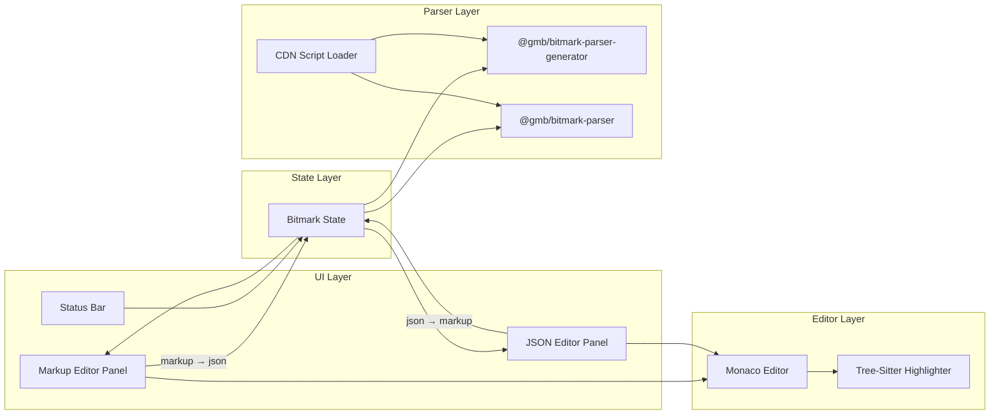
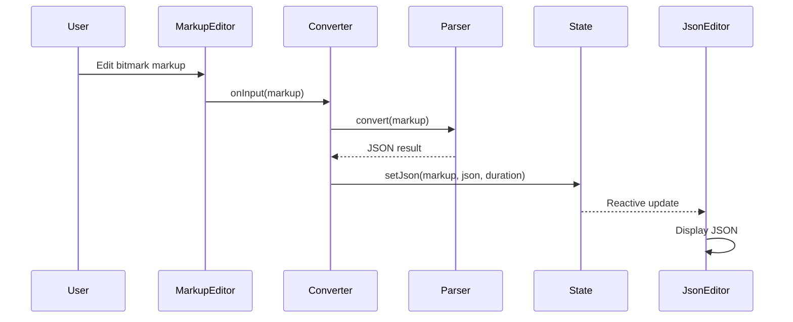
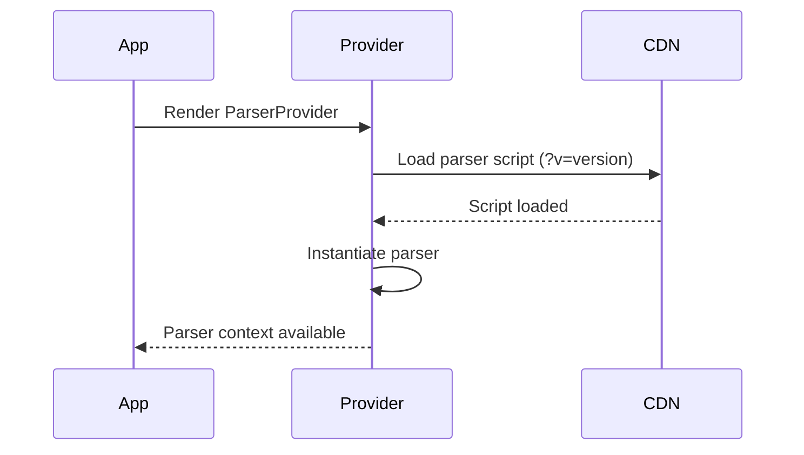

# Architecture

## Project Purpose

bitmark Playground is a web-based tool that enables real-time bidirectional conversion between bitmark markup and JSON, providing developers and content authors with an interactive environment to parse, validate, and experiment with bitmark content.

## System Overview

- UI Layer — React SPA with side-by-side editor panels
- Editor Layer — Monaco Editor with tree-sitter syntax highlighting
- Parser Layer — Pluggable bitmark parsers loaded dynamically from CDN
- State Layer — Reactive state management via Valtio
- Build Layer — Bun-based build tooling with react-app-rewired

## Technology Stack

- `React 18` — UI framework
- `TypeScript 5` — Type-safe development
- `Monaco Editor 0` — Code editor component
- `web-tree-sitter 0` — Syntax highlighting via tree-sitter grammars
- `Valtio 1` — Proxy-based reactive state management
- `Theme UI 0` — Themeable component styling
- `react-app-rewired 2` — CRA configuration overrides without ejecting
- `Bun 1` — Package management, build, and development runtime
- `@gmb/bitmark-parser-generator` — PEG-based bitmark parser (CDN-loaded)
- `@gmb/bitmark-parser` — Rust-based bitmark parser (CDN-loaded)

## High-Level Architecture



## Directory Structure

```
src/                              # Application source code
src/components/bitmark/           # Bitmark-specific editor panels and duration displays
src/components/monaco/            # Monaco editor wrapper components
src/components/version/           # Version and copyright display components
src/components/generic/           # Reusable generic UI components and utilities
src/services/                     # Parser loading, conversion, and application info services
src/state/                        # Valtio-based reactive state
src/theme/                        # Theme UI theme configuration
src/monaco-tree-sitter/           # Tree-sitter integration for Monaco syntax highlighting
src/monaco-tree-sitter/grammars/  # Tree-sitter grammar definitions (JSON)
src/monaco-tree-sitter/themes/    # Tree-sitter theme definitions (JSON)
src/logging/                      # Console logging wrapper
src/utils/                        # Shared utility functions
src/generated/                    # Auto-generated build metadata
scripts/                          # Build-time scripts
public/                           # Static assets and HTML template
config-overrides.js               # Webpack configuration overrides
```

## Component Details

### UI Layer

Side-by-side editor layout with a bitmark markup panel (left) and a JSON panel (right), plus a status bar showing version and copyright.

RESPONSIBILITIES

- Render two-panel editor layout (markup and JSON)
- Display conversion duration per panel
- Show application version and parser version in status bar
- Apply dark theme via Theme UI provider

CONSTRAINTS

- Full viewport height and width layout
- Panels must be equal width (50/50 split)

### Editor Layer

Monaco Editor instances with tree-sitter-based syntax highlighting for bitmark markup.

RESPONSIBILITIES

- Provide code editing with Monaco Editor
- Apply tree-sitter grammar highlighting for bitmark language
- Auto-resize editors to fit container via ResizeObserver
- Suppress re-renders when editor has focus (uncontrolled input pattern)

CONSTRAINTS

- Only JSON language mode uses built-in Monaco highlighting
- Bitmark language highlighting requires tree-sitter WASM initialization
- Monaco webpack plugin must be configured via config-overrides.js

### Parser Layer

Pluggable bitmark parsers loaded dynamically from CDN at runtime, selectable by the user.

RESPONSIBILITIES

- Load parser libraries from jsdelivr CDN via script injection
- Support version selection via URL query parameter (`?v=`)
- Provide `@gmb/bitmark-parser-generator` (PEG-based parser)
- Provide `@gmb/bitmark-parser` (Rust/WASM-based parser)
- Expose bidirectional conversion: markup-to-JSON and JSON-to-markup
- Measure and report conversion duration

CONSTRAINTS

- Parsers are loaded at runtime, not bundled
- Parser version is controlled via URL query parameter
- Application must handle load failures gracefully

### State Layer

Centralized reactive state for bitmark conversion results using Valtio proxies.

RESPONSIBILITIES

- Store current markup and JSON representations
- Store conversion errors and error strings
- Store conversion duration metrics
- Track conversion update counts
- Provide reactive snapshots to UI components via `useSnapshot`

CONSTRAINTS

- State mutations must go through defined setter methods
- State object is a Valtio proxy; consumers must use snapshots for reads

### Build Layer

Bun-based build and development tooling using Create React App with react-app-rewired.

RESPONSIBILITIES

- Generate build-info metadata from package.json at build time
- Override CRA webpack config for Monaco Editor plugin
- Serve development server on port 3010
- Deploy production build to GitHub Pages

CONSTRAINTS

- Must use react-app-rewired (not ejected CRA)
- Monaco webpack plugin must be configured for JSON language worker

## Component Interactions

The UI renders two Monaco editor panels. When a user edits bitmark markup, the markup text is passed to the active parser service which converts it to JSON. The resulting JSON (or error) is stored in the Valtio state, which reactively updates the JSON panel. The reverse flow works identically: editing JSON triggers conversion to markup. The parser library is loaded asynchronously from CDN on application start; the UI shows a loading indicator until the parser is ready.

### Conversion Flow



### Parser Loading Flow



## Architectural Rules

- Parsers MUST be loaded from CDN at runtime, never bundled
- State mutations MUST go through Valtio proxy setter methods
- UI components MUST read state via `useSnapshot`, never directly from proxy
- Monaco editor components MUST suppress re-renders when focused (uncontrolled pattern)
- Tree-sitter WASM MUST be initialized before applying syntax highlighting
- Webpack overrides MUST use react-app-rewired, not CRA ejection
- Build info MUST be auto-generated from package.json before each build/start

## Release Status

STATUS: Alpha

Core markup-to-JSON and JSON-to-markup conversion is functional. Deployed to GitHub Pages.

## Developer Commands

- `bun install` — Install dependencies
- `bun start` — Start development server (port 3010)
- `bun run build` — Build for production
- `bun test` — Run test suite

## Change Log

- 1.0.0 (2026-02-17): Initial architecture
